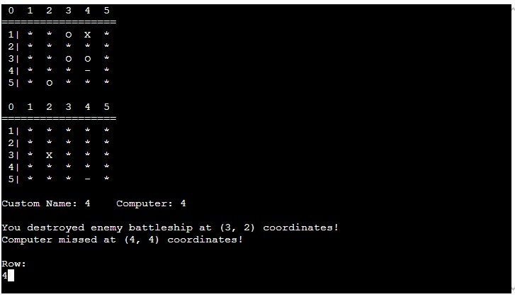
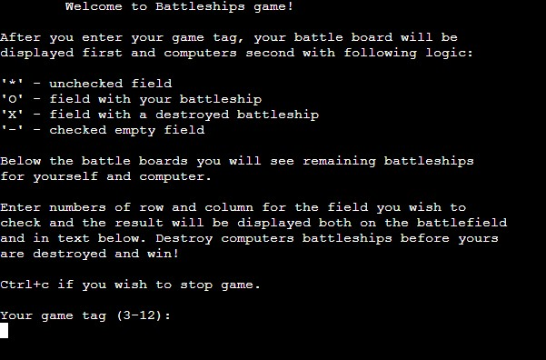
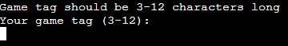
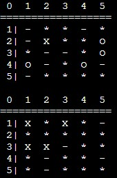
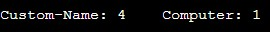
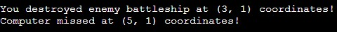
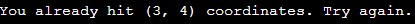
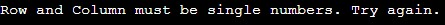
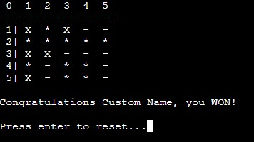

# Terminal Battleships

Terminal Battleships is a simple modification of a classic [Battleships](https://en.wikipedia.org/wiki/Battleship_(game)) game.
It is entirely in python terminal and runs on [Code Institute](https://codeinstitute.net/global/)'s mock terminal.

Playable [live version is here](https://battleships-damir-6a4a40608a2c.herokuapp.com).

 ## FEATURES

  ### Welcome screen with instructions

  First view is a welcome with short instructions on how to play and how to interpret graphical representation of playing boards

  

  ### Customizable player name

  Immediately on welcome screen user is provided an opportunity to select their game tag giving a personal feeling to the game.

  **Game tag verification**

  Due to limited spacing in terminal environment game tag is verified to be between three and twelve characters long. If this is not the case game will display an explanation message

  

  ### Graphical board representation

  During gameplay user can see concise graphical representation of board status with different symbols representing battleships, destroyed battleships, checked fields, and unchecked fields in form of a numbered grid. This provides a game feeling and makes input decision easy.

  

  ### Score display

  Remaining battleships for each player are shown as score display right below graphical representation

  

  ### Game messages

  After every play turn game messages are displayed for both player and computer action. This clarifies last moves and adds to clarity of game status.

  

  ### User input validation
 
  To avoid accidental invalid input crashing the game, input is validated. Game will display a short explanation for two different scenarios; when coordinates are out of game map and when coordinates are not numbers.

  

  

  ### Endgame screen and reset functionality

  Once one of the players destroys opponents final battleship game will show an end screen. It consists of graphical representation of losing players board, winner declaration and an option to restart the game.

  

  ### Future features

  - code is ready for custom board size setting functionality in case of larger terminal space
  - allow user to pick battleship locations personally
  - make different battleship types to resemble classical game more closely
  - add high score keeping for fastest winners

 

## DATA MODEL

Game uses a class for board setting and tracking. "Board" class consists of a list of lists representing rows and columns of game fields, a string for player name, an integer for battleship number which is used as score and and integer for size (number of rows and columns). 
Initializing modal sets these values filling the list of lists with unchecked game fields then calls it's own modal for randomizing battleship locations.
"Board" class is completed with a modal 'draw_self' that displays a numbered grid and current state of its list of lists as rows and columns.

Game messages are stored in a dictionary with two keys: 'player' and 'computer'.

## BUGS

  ### FIXED DURING TESTING

  | PROBLEM | FIX |
  | - | - | 
  | too few battleships added to game | set number of battleships to size **squared**  divided by 5 (accidentally used only size) |
  | user input for *column* treated as tuple instead of string | removed an accidental comma after input function *input("Column:\n")**,*** |
  | computer game message showing list index as coordinates instead of game coordinates | added +1 to column and row index for display |
  | after game reset last game message from computer stays | configured main function to set default data vales for everything, reset calls main function |
   

  ### CURRENT BUGS

  No bugs after testing phase, all features work as intended!

   

## FINAL TESTING INFORMATION

  ### MANUAL USAGE TEST

  | Test | Result |
  |-|-|
  |input game tag less than three and more than twelve characters | appropriate message displayed, input repeated |
  |input number out of range for row|appropriate message displayed, input repeated|
  |input number out of range for column|appropriate message displayed, input repeated|
  |input non number for row|appropriate message displayed, input repeated|
  |input non number for column|appropriate message displayed, input repeated|
  |input repeated guess|appropriate message displayed, input repeated|
  |hit enemy battleship|appropriate message displayed, board status changed, display updated|
  |miss enemy battleship|appropriate message displayed, board status changed, display updated|
  |check computer guesses|each possibility acting as intended
  |destroy all enemy battleships|appropriate endscreen displayed, winner announced|
  |computer destroys all battleships|appropriate endscreen displayed, winner announced|
  |test game reset after end|behaving as intended
  ||||

  ### CODE VALIDATION

  **PEP8** 
  - using *pycodestyle* to check against pep8 standard returns no errors or warnings

   

## BUILD CONTEXT

### ENVIRONMENT

  Entire project was built in [Gitpod](https://www.gitpod.io) using git for version control.

### DEPLOYMENT

  Project is deployed on [Heroku](https://www.heroku.com) using [Code Institute](https://codeinstitute.net/global/)'s mock terminal.

  **HOW TO DEPLOY**
  - clone or fork this repository
  - go to Heroku
  - create a new Heroku application
  - go to deploy section
  - connect via github to your clone/fork
  - go to settings
  - click on Config Vars
  - enter "PORT" as "KEY" and "8000" as "VALUE"
  - click on add buildpack
  - add python and nodejs buildpacks in that order
  - go back to deploy section
  - choose manual or automatic deployment
    

## CREDITS

  - [Code Institute](https://codeinstitute.net/global/) for mock terminal enabling deployment
  - how to clear terminal found [here](https://stackoverflow.com/questions/2084508/clear-the-terminal-in-python)
  - how switch statement works in python found [here](https://www.freecodecamp.org/news/python-switch-statement-switch-case-example)
  - how comparison simplification can be done in python found [here](https://stackoverflow.com/questions/26502775/simplify-chained-comparison)
  - for checking against PEP8 standard i used [*pycodestyle*](https://pycodestyle.pycqa.org/en/latest/)